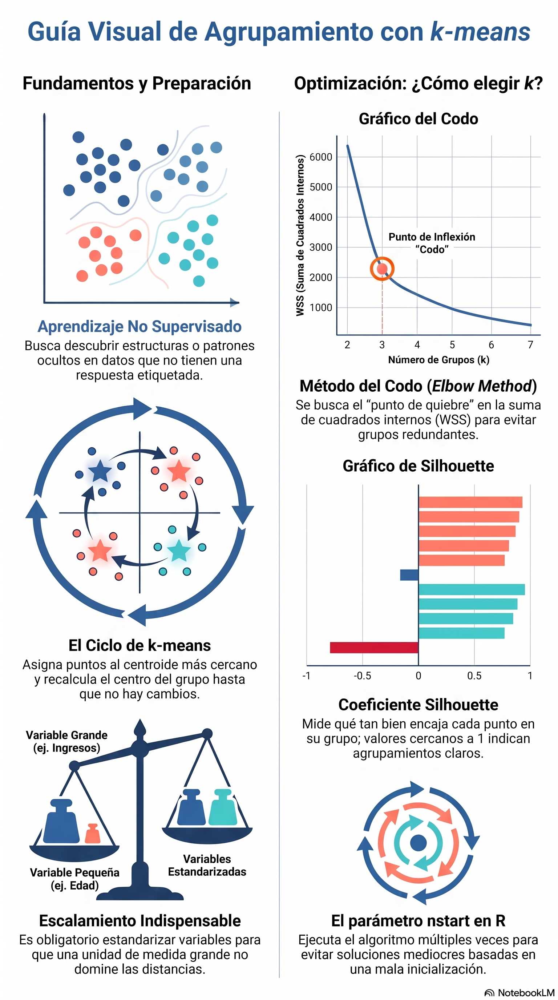

# Agrupamiento con k-means


::: {.callout-note title="Conexión con el volumen teórico"}

La formulación matemática de **distancias, función objetivo, centroides y agrupamiento k-means** se desarrolla con mayor profundidad
en los capítulos 2 y 18 de *Fundamentos Matemáticos del Aprendizaje
Automático* [@rodriguez2026fundamentos].

:::

## Objetivos de aprendizaje

Al finalizar este capítulo podrás:

- distinguir aprendizaje supervisado y no supervisado;
- explicar intuitivamente el algoritmo k-means;
- calcular centroides y asignar observaciones a grupos;
- implementar k-means manualmente y con `kmeans()`;
- seleccionar el número de grupos mediante el método del codo y silhouette;
- interpretar centroides y perfiles de los grupos;
- reconocer las limitaciones y los errores frecuentes;
- aplicar el algoritmo a datos reales.

## Del aprendizaje supervisado al no supervisado

En los capítulos anteriores conocíamos la variable de respuesta. En el aprendizaje no supervisado no existe una etiqueta conocida que indique el grupo correcto. El objetivo es descubrir estructura en los datos.

El **agrupamiento** o *clustering* reúne observaciones similares y separa observaciones diferentes.

## Idea intuitiva de k-means

k-means busca dividir las observaciones en $k$ grupos. Cada grupo se representa mediante un **centroide**, que es el promedio de sus observaciones.

El algoritmo repite dos operaciones:

1. asignar cada observación al centroide más cercano;
2. recalcular los centroides.

El proceso termina cuando las asignaciones dejan de cambiar o la mejora es muy pequeña.

## Función objetivo

k-means minimiza la suma de cuadrados dentro de los grupos:

$$
WSS=\sum_{j=1}^{k}\sum_{\mathbf{x}_i\in C_j}\|\mathbf{x}_i-\boldsymbol{\mu}_j\|^2
$$

Aquí, $C_j$ es el grupo $j$ y $\boldsymbol{\mu}_j$ es su centroide.

## Ejemplo manual

Considera seis puntos:

| Punto | x | y |
|---|---:|---:|
| A | 1 | 1 |
| B | 1.5 | 2 |
| C | 3 | 4 |
| D | 5 | 7 |
| E | 3.5 | 5 |
| F | 4.5 | 5 |

Si fijamos $k=2$, elegimos dos centroides iniciales, asignamos cada punto al más cercano y recalculamos los promedios de ambos grupos. Repetimos hasta estabilizar.

## Implementación básica en R

```{r}
datos <- data.frame(
  x = c(1, 1.5, 3, 5, 3.5, 4.5),
  y = c(1, 2, 4, 7, 5, 5)
)

datos
```

```{r}
set.seed(123)
modelo_km <- kmeans(datos, centers = 2, nstart = 25)
modelo_km
```

```{r}
datos$cluster <- factor(modelo_km$cluster)
plot(
  datos$x, datos$y,
  col = datos$cluster,
  pch = 19,
  xlab = "x", ylab = "y",
  main = "Agrupamiento k-means"
)
points(modelo_km$centers, pch = 8, cex = 2, lwd = 2)
```

## ¿Por qué usar `nstart`?

k-means depende de los centroides iniciales. `nstart = 25` ejecuta el algoritmo varias veces y conserva la solución con menor variación interna.

## Escalamiento de variables

Si una variable está medida en miles y otra entre 0 y 10, la primera dominará las distancias. Por ello suele ser necesario estandarizar:

$$
z=\frac{x-\bar{x}}{s}
$$

```{r}
X <- scale(iris[, 1:4])
head(X)
```

## Aplicación con `iris`

```{r}
set.seed(2026)
km_iris <- kmeans(X, centers = 3, nstart = 50)

table(
  Cluster = km_iris$cluster,
  Especie = iris$Species
)
```

Los números de los clusters no tienen significado previo. El grupo 1 no es mejor ni peor que el grupo 2.

## Interpretación de centroides

```{r}
km_iris$centers
```

Cada fila representa un perfil promedio estandarizado. Valores positivos indican niveles superiores a la media; valores negativos, inferiores.

## Método del codo

El método del codo compara la suma de cuadrados interna para distintos valores de $k$.

```{r}
valores_k <- 1:10
wss <- numeric(length(valores_k))

for (i in seq_along(valores_k)) {
  set.seed(123)
  ajuste <- kmeans(X, centers = valores_k[i], nstart = 25)
  wss[i] <- ajuste$tot.withinss
}

plot(
  valores_k, wss,
  type = "b",
  xlab = "Número de clusters k",
  ylab = "Suma de cuadrados interna",
  main = "Método del codo"
)
```

Se busca un punto a partir del cual añadir grupos produce mejoras pequeñas.

## Coeficiente silhouette

Silhouette compara cohesión interna y separación externa. Sus valores se encuentran entre -1 y 1:

- cerca de 1: agrupamiento claro;
- cerca de 0: observación fronteriza;
- negativo: posible asignación incorrecta.

```{r}
#| eval: false
if (!requireNamespace("cluster", quietly = TRUE)) {
  install.packages("cluster", repos = "https://cloud.r-project.org")
}

sil <- cluster::silhouette(km_iris$cluster, dist(X))
mean(sil[, "sil_width"])
plot(sil)
```

## Laboratorio interactivo k-means

::: {.content-visible when-format="html"}

Modifica el número de grupos y observa cómo cambian los centroides y la separación.

```{shinylive-r}
#| standalone: true
#| viewerHeight: 690
#| components: [viewer]

library(shiny)

ui <- fluidPage(
  titlePanel("Laboratorio interactivo: k-means"),
  sidebarLayout(
    sidebarPanel(
      sliderInput("k", "Número de grupos", 2, 6, 3, 1),
      sliderInput("n", "Número de observaciones", 30, 200, 90, 10),
      sliderInput("disp", "Dispersión", 0.2, 2.0, 0.7, 0.1),
      numericInput("semilla", "Semilla", 123, 1),
      actionButton("actualizar", "Generar y agrupar")
    ),
    mainPanel(
      plotOutput("grafica", height = "450px"),
      tableOutput("resumen")
    )
  )
)

server <- function(input, output, session) {
  datos <- eventReactive(input$actualizar, {
    set.seed(input$semilla)
    centros <- matrix(c(-3,-2, 0,3, 3,-1, -2,4, 4,4, 0,-4), ncol=2, byrow=TRUE)
    g <- sample(seq_len(input$k), input$n, replace=TRUE)
    data.frame(
      x = centros[g,1] + rnorm(input$n, sd=input$disp),
      y = centros[g,2] + rnorm(input$n, sd=input$disp)
    )
  }, ignoreNULL=FALSE)

  ajuste <- reactive({
    set.seed(input$semilla)
    kmeans(datos(), centers=input$k, nstart=25)
  })

  output$grafica <- renderPlot({
    d <- datos(); km <- ajuste()
    plot(d$x, d$y, col=km$cluster, pch=19,
         xlab="Variable 1", ylab="Variable 2",
         main=paste("k-means con k =", input$k))
    points(km$centers, pch=8, cex=2.2, lwd=3)
    grid()
  })

  output$resumen <- renderTable({
    km <- ajuste()
    data.frame(
      Cluster=seq_len(input$k),
      Tamaño=as.integer(km$size),
      Centro_X=round(km$centers[,1],2),
      Centro_Y=round(km$centers[,2],2)
    )
  })
}

shinyApp(ui, server)
```

:::

::: {.content-visible when-format="pdf"}
El laboratorio interactivo de k-means está disponible en la versión web del capítulo. Permite modificar $k$, el tamaño de la muestra y la dispersión de los grupos.
:::

## Ventajas

- sencillo e intuitivo;
- rápido en conjuntos medianos y grandes;
- fácil de visualizar;
- útil para segmentación y exploración;
- disponible en R base.

## Limitaciones

- requiere fijar $k$;
- depende de la inicialización;
- es sensible a escalas y valores atípicos;
- favorece grupos aproximadamente esféricos;
- no maneja bien clusters con densidades muy diferentes;
- solo trabaja naturalmente con variables numéricas.

## Errores frecuentes

1. No estandarizar variables.
2. Elegir $k$ únicamente porque coincide con una expectativa previa.
3. Ejecutar una sola inicialización.
4. Interpretar los números de cluster como categorías ordenadas.
5. Incluir identificadores.
6. Ignorar valores atípicos.
7. Confundir clusters con clases verdaderas.
8. Describir grupos sin revisar sus centroides.

## Aplicación con datos reales

En accidentes de tránsito pueden agruparse municipios, horarios o tipos de accidente usando variables como número de víctimas, frecuencia, hora, zona y severidad. El objetivo no es predecir una etiqueta, sino descubrir perfiles semejantes.

## Actividad guiada

1. Selecciona cuatro variables numéricas de un conjunto real.
2. Trata valores faltantes.
3. Estandariza los datos.
4. Evalúa valores de $k$ entre 2 y 10.
5. Usa el método del codo.
6. Calcula silhouette.
7. Entrena el modelo final con `nstart = 50`.
8. Interpreta los centroides.
9. Asigna nombres descriptivos a los perfiles.
10. Explica las limitaciones del análisis.

## Ejercicios

1. Implementa una iteración manual de k-means.
2. Compara resultados con y sin estandarización.
3. Cambia la semilla y analiza la estabilidad.
4. Agrega valores atípicos.
5. Compara $k=2$, $k=3$ y $k=5$.
6. Contrasta el método del codo y silhouette.
7. Aplica k-means a datos ambientales o de accidentes.


## Caso aplicado B: k-means con COVID-19

En esta segunda ruta aplicada usamos datos abiertos de COVID-19 México 2022 para descubrir **perfiles de observaciones semejantes**. A diferencia de los capítulos de clasificación, k-means es un método no supervisado: por ello la variable `MURIO` **no participa en la formación de los grupos**.

> **Uso académico:** los clusters representan patrones estadísticos dentro de esta muestra. No son categorías clínicas, diagnósticos ni niveles de riesgo médico.

### Preparar las variables para agrupamiento

Usamos variables numéricas relacionadas con edad y comorbilidades. Las variables binarias se mantienen como 0/1 y todas se estandarizan para evitar que una escala domine las distancias.

```{r covid-kmeans-preparar}
ruta_covid <- "datos/covid19/procesados/covid19_mexico_2022_ml_preparado.csv.gz"

if (file.exists(ruta_covid)) {
  covid_km <- readr::read_csv(ruta_covid, show_col_types = FALSE) |>
    dplyr::select(
      MURIO, EDAD, NEUMONIA, DIABETES, HIPERTENSION,
      OBESIDAD, RENAL_CRONICA, NUM_COMORBILIDADES
    ) |>
    tidyr::drop_na()

  set.seed(2026)
  covid_km <- covid_km |>
    dplyr::sample_n(min(12000, nrow(covid_km)))

  variables_km <- c(
    "EDAD", "NEUMONIA", "DIABETES", "HIPERTENSION",
    "OBESIDAD", "RENAL_CRONICA", "NUM_COMORBILIDADES"
  )

  X_covid_km <- scale(covid_km[variables_km])
}
```

::: {.callout-important title="MURIO queda fuera del agrupamiento"}
`MURIO` se conserva únicamente para una interpretación posterior. No se incluye en `X_covid_km`, de modo que los clusters se forman sin conocer la variable de defunción.
:::

### Explorar el número de grupos con el método del codo

```{r covid-kmeans-codo, fig.width=7, fig.height=4.5}
if (exists("X_covid_km")) {
  valores_k_covid <- 1:8
  wss_covid <- numeric(length(valores_k_covid))

  for (i in seq_along(valores_k_covid)) {
    set.seed(2026)
    ajuste <- kmeans(
      X_covid_km,
      centers = valores_k_covid[i],
      nstart = 30,
      iter.max = 100
    )
    wss_covid[i] <- ajuste$tot.withinss
  }

  plot(
    valores_k_covid, wss_covid,
    type = "b", pch = 19,
    xlab = "Número de clusters k",
    ylab = "Suma de cuadrados interna",
    main = "COVID-19: método del codo"
  )
}
```

El método del codo no elige automáticamente un valor perfecto de \(k\); ayuda a identificar cuándo agregar más clusters produce mejoras cada vez menores.

### Comparar silhouette

Para que el cálculo de distancias sea ligero, se evalúa silhouette sobre una submuestra reproducible.

```{r covid-kmeans-silhouette}
if (exists("X_covid_km")) {
  set.seed(2026)
  n_sil <- min(2500, nrow(X_covid_km))
  idx_sil <- sample(seq_len(nrow(X_covid_km)), n_sil)
  X_sil <- X_covid_km[idx_sil, , drop = FALSE]
  dist_sil <- dist(X_sil)

  sil_promedio <- sapply(2:6, function(k_actual) {
    set.seed(2026)
    km_tmp <- kmeans(X_sil, centers = k_actual, nstart = 30)
    sil_tmp <- cluster::silhouette(km_tmp$cluster, dist_sil)
    mean(sil_tmp[, "sil_width"])
  })

  data.frame(
    k = 2:6,
    silhouette_promedio = sil_promedio
  )
}
```

### Ajustar una solución didáctica con tres clusters

Para mantener la interpretación sencilla usamos \(k=3\). En un análisis formal, este valor debería justificarse conjuntamente con el codo, silhouette, estabilidad e interpretabilidad.

```{r covid-kmeans-modelo}
if (exists("X_covid_km")) {
  set.seed(2026)
  modelo_covid_km <- kmeans(
    X_covid_km,
    centers = 3,
    nstart = 50,
    iter.max = 100
  )

  covid_km$cluster <- factor(modelo_covid_km$cluster)
  table(covid_km$cluster)
}
```

### Interpretar los centroides

```{r covid-kmeans-centroides}
if (exists("modelo_covid_km")) {
  centroides_covid <- as.data.frame(modelo_covid_km$centers)
  centroides_covid$cluster <- factor(seq_len(nrow(centroides_covid)))
  centroides_covid
}
```

Como los datos están estandarizados, un centroide positivo indica que el cluster presenta, en promedio, valores superiores a la media de la muestra para esa variable; un valor negativo indica valores inferiores.

### Perfil descriptivo en unidades originales

```{r covid-kmeans-perfiles}
if (exists("modelo_covid_km")) {
  perfiles_covid <- covid_km |>
    dplyr::group_by(cluster) |>
    dplyr::summarise(
      n = dplyr::n(),
      edad_media = mean(EDAD),
      neumonia_pct = mean(NEUMONIA) * 100,
      diabetes_pct = mean(DIABETES) * 100,
      hipertension_pct = mean(HIPERTENSION) * 100,
      obesidad_pct = mean(OBESIDAD) * 100,
      renal_cronica_pct = mean(RENAL_CRONICA) * 100,
      comorbilidades_media = mean(NUM_COMORBILIDADES),
      .groups = "drop"
    )

  perfiles_covid
}
```

### Observar `MURIO` después de formar los grupos

Ahora sí usamos la variable `MURIO`, pero únicamente como una **descripción externa** de los clusters ya construidos.

```{r covid-kmeans-murio}
if (exists("modelo_covid_km")) {
  mortalidad_por_cluster <- covid_km |>
    dplyr::group_by(cluster) |>
    dplyr::summarise(
      casos = dplyr::n(),
      defunciones_registradas = sum(MURIO == 1),
      porcentaje_defuncion = mean(MURIO == 1) * 100,
      .groups = "drop"
    )

  mortalidad_por_cluster
}
```

::: {.callout-warning title="Interpretación correcta"}
Una diferencia en el porcentaje de defunción entre clusters **no demuestra causalidad** y tampoco convierte k-means en un modelo predictivo. Los grupos fueron definidos únicamente por semejanza en las variables de entrada.
:::

### Visualización bidimensional mediante PCA

La siguiente gráfica usa PCA solo para proyectar los clusters en dos dimensiones y facilitar su visualización; el agrupamiento continúa siendo el realizado en el espacio estandarizado original.

```{r covid-kmeans-pca, fig.width=7, fig.height=5}
if (exists("modelo_covid_km")) {
  pca_covid_km <- prcomp(X_covid_km, center = FALSE, scale. = FALSE)

  grafica_covid_km <- data.frame(
    PC1 = pca_covid_km$x[, 1],
    PC2 = pca_covid_km$x[, 2],
    cluster = covid_km$cluster
  )

  ggplot2::ggplot(
    grafica_covid_km,
    ggplot2::aes(x = PC1, y = PC2, color = cluster)
  ) +
    ggplot2::geom_point(alpha = 0.35, size = 1.2) +
    ggplot2::labs(
      title = "Perfiles COVID-19 obtenidos con k-means",
      subtitle = "Proyección PCA para visualizar los clusters",
      x = "Componente principal 1",
      y = "Componente principal 2",
      color = "Cluster"
    ) +
    ggplot2::theme_minimal()
}
```

::: {.callout-tip title="Qué aprendemos con este caso"}
Este ejercicio muestra una diferencia fundamental: en clasificación usamos una etiqueta para aprender a predecirla; en clustering buscamos estructura sin etiqueta. Después podemos relacionar los grupos con variables externas para describirlos, pero no para afirmar que esas variables causaron los clusters.
:::


## Laboratorio interactivo COVID: agrupamiento k-means

Este laboratorio utiliza una **submuestra reproducible de la muestra COVID-19 México 2022 incluida en el libro**. Puedes modificar el número de clusters y observar cómo cambian los perfiles en una proyección de componentes principales.

::: {.content-visible when-format="html"}

```{shinylive-r}
#| standalone: true
#| viewerHeight: 780
#| components: [viewer]

library(shiny)

covid_interactivo <- data.frame(
  EDAD = c(41,20,13,45,67,60,25,60,28,20,37,3,72,57,31,61,50,33,58,25,92,74,12,30,36,58,20,69,51,24,47,29,28,49,42,67,81,30,20,37,28,74,59,37,86,33,18,56,36,56,64,23,47,27,82,69,43,50,62,26,22,31,40,34,36,63,88,54,22,53,22,23,26,53,55,24,36,82,33,38,41,45,46,83,36,60,75,53,26,24,62,54,65,69,17,31,29,91,75,31,48,31,21,79,67,70,40,38,49,50,51,36,45,83,49,37,56,32,21,21,21,76,62,14,38,82,52,46,78,86,27,43,54,42,60,39,73,67,70,65,44,61,77,32,90,82,61,79,74,92,21,44,52,87,73,59,33,20,71,58,7,44,30,79,74,89,79,24,30,19,56,3,67,31,75,21,52,59,41,69,64,54,80,23,60,77,49,56,59,23,44,38,53,60,57,34,80,37,65,41,46,38,36,42,56,71,50,36,57,17,55,33,25,55,60,61,29,74,47,48,31,23,71,37,57,20,88,70,61,81,29,19,31,48,60,34,56,23,35,34,91,82,49,63,75,24,89,22,24,35,67,36,38,80,29,75,60,52,52,33,56,44,12,38,31,92,62,22,26,59,29,41,36,50,66,71,41,44,29,41,71,39,22,64,48,18,70,25,65,14,33,11,44,32,59,59,36,4,90,54,7,81,54,77,11,40,20,53,34,34,44,87,32,35,23,26,39,55,65,41,20,89,31,50,63,51,31,8,52,26,70,64,34,46,82,68,40,59,24,41,59,44,76,48,30,72,41,43,51,49,39,35,24,40,28,39,73,29,56,68),
  NEUMONIA = c(0,0,0,0,1,0,0,0,0,0,0,0,0,0,0,0,0,0,1,0,0,1,0,0,0,1,0,0,0,0,0,0,0,0,1,1,0,1,0,0,0,0,0,0,0,0,0,0,0,0,0,0,0,0,1,0,0,0,1,0,0,0,0,0,0,1,0,0,1,0,0,0,0,0,0,0,0,1,0,0,0,0,0,1,0,1,1,0,0,0,0,0,0,0,0,0,0,0,0,0,0,0,0,1,0,0,1,0,1,0,0,0,0,1,1,0,0,0,0,0,0,1,0,0,0,0,0,0,0,0,0,0,0,0,1,0,0,0,1,1,0,0,0,0,1,1,1,1,1,1,0,0,0,1,0,0,0,0,0,0,0,0,0,0,0,1,0,0,0,0,0,1,1,0,0,0,0,1,1,1,0,0,1,0,1,0,0,1,0,0,0,0,0,0,1,0,0,0,0,0,0,0,0,0,0,0,0,0,0,0,0,0,0,0,0,0,0,0,1,0,0,0,1,0,0,0,0,0,1,0,0,0,0,0,0,0,0,0,0,0,0,1,0,0,0,0,1,0,0,0,0,0,0,1,0,1,1,0,0,0,0,0,0,0,0,1,0,0,0,0,0,0,0,1,0,1,0,0,0,0,1,0,0,1,0,0,0,0,0,0,0,0,0,0,0,1,0,0,1,0,0,1,0,1,0,1,0,0,0,0,0,0,0,0,0,0,0,0,1,0,0,0,0,1,0,1,0,0,0,0,0,0,1,0,1,0,0,0,0,0,0,0,0,0,0,1,0,0,0,0,0,0,0,0,0,0,0,0,1,1),
  DIABETES = c(0,0,0,0,1,1,0,0,1,0,0,0,1,0,0,1,0,0,0,0,0,0,0,0,0,1,0,0,0,0,0,0,0,0,0,1,0,0,0,0,0,0,0,0,1,0,0,0,0,0,0,0,1,0,0,0,0,1,0,0,0,0,0,0,0,0,1,0,1,0,0,0,0,0,0,0,0,1,0,0,0,0,0,0,0,1,1,0,0,0,0,0,1,0,0,0,0,1,0,0,0,0,0,0,0,1,1,0,1,0,0,0,0,1,0,0,0,0,0,0,0,0,0,0,0,0,0,0,1,0,0,0,0,0,1,0,0,0,1,0,0,0,0,0,1,0,1,1,0,0,0,0,0,1,0,0,0,0,0,0,0,0,0,0,0,0,0,0,0,0,0,0,1,0,1,0,0,0,0,0,1,1,0,0,1,0,0,1,0,0,0,0,1,0,0,0,0,0,0,0,0,0,0,1,0,0,0,0,0,0,0,0,0,0,0,0,1,0,0,0,0,0,1,0,0,0,0,0,1,0,0,0,0,1,0,0,0,0,0,0,0,1,0,0,0,0,1,0,0,0,0,0,1,1,0,0,0,1,0,0,0,0,0,0,0,0,0,0,0,0,0,0,0,0,0,1,0,0,0,0,0,0,0,0,0,0,0,0,1,0,0,0,0,0,0,1,0,0,0,0,0,0,0,0,0,1,0,0,0,0,0,1,0,0,0,0,1,0,0,0,0,0,0,0,0,0,0,0,0,0,0,0,0,0,0,0,0,0,0,1,0,0,0,0,0,0,0,0,0,0,0,0,0,0,0,0,0,0,1,0),
  HIPERTENSION = c(0,0,0,0,1,0,0,0,0,0,0,0,1,0,0,1,0,0,0,0,0,0,0,0,0,1,0,0,0,0,0,0,0,0,0,0,1,0,0,0,0,0,0,0,1,0,0,0,0,1,1,0,0,0,1,0,0,1,0,0,0,0,0,0,0,1,1,1,0,0,0,0,0,0,1,0,0,1,0,0,0,0,1,0,0,0,1,0,0,0,0,0,0,0,0,0,0,1,0,0,1,0,0,0,0,1,1,0,0,0,0,0,0,1,0,0,1,0,0,0,0,0,0,0,0,0,0,0,0,1,0,0,1,0,1,0,1,0,1,0,0,0,0,0,1,0,0,0,1,0,0,0,0,1,0,0,0,0,0,0,0,0,0,0,1,0,0,0,0,0,0,0,0,0,0,0,0,0,0,1,1,1,0,0,0,1,0,0,0,0,0,0,1,0,1,0,1,0,0,1,0,0,0,0,0,0,0,0,0,0,0,0,0,0,0,0,0,1,0,0,0,0,0,0,0,0,0,1,1,0,0,0,0,1,0,0,0,0,0,0,0,1,0,0,0,0,1,0,0,0,1,0,1,1,0,0,0,1,1,0,0,0,0,0,1,1,1,0,0,0,0,1,0,0,0,0,0,0,0,0,0,0,0,0,0,0,1,0,1,0,0,0,1,0,1,1,0,0,1,0,0,0,0,0,0,0,0,0,0,0,1,1,0,0,0,0,0,0,1,1,0,1,0,0,0,0,0,0,0,0,0,0,0,0,0,0,0,0,0,1,0,0,0,1,0,1,0,0,0,0,0,0,0,0,0,0,0,0,1,0),
  OBESIDAD = c(0,0,0,0,1,1,0,0,0,0,1,0,0,0,0,0,0,0,0,0,0,0,0,0,0,0,0,0,0,0,0,0,0,0,0,0,1,0,0,0,0,0,0,0,0,0,0,0,0,0,0,0,0,0,0,0,1,0,0,0,0,0,0,0,0,0,1,0,1,1,0,0,0,0,0,0,0,0,0,0,1,0,0,0,0,0,0,0,0,0,0,0,0,0,0,0,0,1,0,0,0,0,0,0,0,0,0,0,0,0,0,0,0,0,1,0,0,0,0,0,0,0,0,0,0,0,0,0,0,0,0,0,0,0,0,0,0,0,0,0,0,0,0,0,0,0,0,0,0,0,0,0,0,0,0,0,0,0,0,0,0,0,0,1,0,0,1,0,0,0,0,0,0,0,0,0,0,0,0,1,0,1,0,0,0,0,0,1,0,0,0,0,0,0,0,0,0,0,0,0,0,0,0,1,0,0,1,0,0,0,0,0,0,0,0,0,0,0,0,0,0,0,1,0,0,0,0,0,0,0,0,0,0,1,0,0,0,0,0,0,0,0,0,0,0,0,0,0,0,0,0,0,0,0,0,0,1,1,0,0,0,0,0,0,0,0,0,0,0,0,0,0,0,0,0,0,1,0,0,0,0,0,0,0,0,0,0,0,0,0,0,0,0,0,0,0,0,0,0,0,0,0,0,0,0,0,0,0,0,0,1,0,0,0,0,0,0,0,0,0,0,0,0,0,0,0,0,0,0,0,0,0,0,0,0,0,0,0,0,0,0,0,0,1,0,0,0,0,0,0,0,0,0,0,0,0,0,0,1,0),
  RENAL_CRONICA = c(0,0,0,0,0,0,0,0,0,0,0,0,0,0,0,0,0,0,0,0,0,0,0,0,0,0,0,0,0,0,0,0,0,0,0,0,0,0,0,0,0,0,0,0,0,0,0,0,0,0,0,0,0,0,0,0,0,1,0,0,0,0,0,0,0,0,0,0,0,0,0,0,0,0,0,0,0,0,0,0,0,0,0,0,0,0,0,0,0,0,0,0,0,0,0,0,0,0,0,0,0,0,0,0,0,0,0,0,0,0,0,0,0,0,0,0,0,0,0,0,0,0,0,0,0,0,0,0,0,0,0,0,0,0,0,0,0,0,1,0,0,0,0,0,0,0,0,0,1,0,0,0,0,0,0,0,0,0,0,0,0,0,0,0,0,0,0,0,0,0,0,0,0,0,0,0,0,0,0,0,0,0,0,0,0,0,0,0,0,0,0,0,1,0,1,0,0,0,0,0,0,0,0,0,0,0,0,0,0,0,0,0,0,0,0,0,0,1,0,0,0,0,0,0,0,0,0,0,0,0,0,0,0,0,0,0,0,0,0,0,0,0,0,0,0,0,1,0,0,0,0,0,0,1,0,0,0,0,0,0,0,0,0,0,0,0,0,0,0,0,0,0,0,0,0,0,0,0,0,0,0,0,0,0,0,0,0,0,0,0,0,0,0,0,0,0,0,0,0,0,0,0,0,0,0,0,0,0,0,0,0,0,0,0,0,0,0,0,0,0,0,0,0,0,0,0,0,0,0,0,0,0,0,0,0,0,0,0,0,0,0,0,0,0,0,1,0,0,0,0,0,0,0,0,0,0,0,0,1,0),
  NUM_COMORBILIDADES = c(1,0,0,0,3,2,0,0,1,0,2,0,3,0,0,2,0,0,0,0,0,0,0,0,0,2,0,0,0,0,0,0,0,0,0,1,3,0,0,0,0,0,0,0,2,0,0,0,0,1,1,0,1,0,1,1,1,3,0,1,0,0,0,0,0,1,3,1,2,1,0,0,0,0,1,0,0,2,0,0,2,0,1,0,0,1,2,0,0,0,0,0,1,0,0,0,0,3,1,0,1,0,0,0,0,2,2,1,1,0,0,0,0,2,1,0,2,0,0,0,0,0,0,0,0,0,1,0,2,1,0,0,1,0,2,0,1,0,4,0,0,0,1,0,3,2,1,1,2,0,0,0,0,5,0,0,0,0,0,0,0,0,0,1,1,0,1,0,0,0,0,0,1,0,1,0,0,0,0,3,2,3,0,0,2,1,0,2,0,0,0,0,3,0,2,0,1,0,0,1,0,0,0,2,0,0,1,0,0,0,0,0,0,0,0,2,1,2,1,0,0,0,2,0,0,0,0,1,2,0,0,0,0,3,0,0,0,0,0,0,0,2,0,0,0,0,3,0,0,0,2,0,2,5,0,1,1,3,1,0,0,0,0,0,2,2,1,0,0,0,0,1,0,1,0,1,1,1,0,0,0,0,0,0,0,0,1,0,3,0,0,0,1,0,1,2,0,0,1,0,0,0,1,1,0,2,1,0,0,0,2,4,0,0,0,0,1,0,1,2,0,3,0,0,0,0,0,0,0,0,0,0,0,0,0,1,0,0,0,2,0,0,0,3,0,2,1,0,0,0,0,0,0,0,0,0,0,0,4,0)
)

ui <- fluidPage(
  titlePanel("COVID-19: explorador k-means"),
  sidebarLayout(
    sidebarPanel(
      sliderInput("k", "Número de clusters", min = 2, max = 6, value = 3, step = 1),
      numericInput("semilla", "Semilla", value = 2026, min = 1),
      helpText("MURIO no se utiliza para formar los grupos.")
    ),
    mainPanel(
      plotOutput("grafica", height = "470px"),
      tableOutput("centroides"),
      textOutput("nota")
    )
  )
)

server <- function(input, output, session) {
  resultado <- reactive({
    X <- scale(covid_interactivo)
    set.seed(input$semilla)
    km <- kmeans(X, centers = input$k, nstart = 25)
    pca <- prcomp(X, center = FALSE, scale. = FALSE)
    list(X = X, km = km, pca = pca)
  })

  output$grafica <- renderPlot({
    r <- resultado()
    plot(r$pca$x[,1], r$pca$x[,2],
         col = r$km$cluster, pch = 19,
         xlab = "Componente principal 1",
         ylab = "Componente principal 2",
         main = paste("COVID-19: k-means con k =", input$k))
    grid()
  })

  output$centroides <- renderTable({
    r <- resultado()
    round(r$km$centers, 2)
  }, rownames = TRUE)

  output$nota <- renderText({
    paste0("Los números de cluster no tienen orden clínico. La solución actual explica perfiles de similitud para k = ", input$k, ".")
  })
}

shinyApp(ui, server)
```

:::

::: {.content-visible when-format="pdf"}

### Laboratorio interactivo COVID disponible en la versión web

La versión web permite cambiar el número de clusters y visualizar una submuestra COVID-19 2022 agrupada mediante k-means y proyectada con PCA.

:::

## Materiales complementarios del capítulo

Estos recursos permiten repasar los conceptos principales del capítulo mediante distintos formatos. La presentación puede consultarse en PDF o modificarse en PowerPoint; la infografía ofrece una síntesis visual, el video explica los contenidos y el cuaderno Colab permite ejecutar los ejemplos de manera autónoma.

| Recurso | Utilidad | Abrir o reproducir | Descargar |
|---|---|---|---|
| Video explicativo | Explicación audiovisual de los contenidos del capítulo. | [Ver en YouTube](https://www.youtube.com/watch?v=mZgUlnSxrgA){target="_blank"} | — |
| Presentación en PDF | Diapositivas para lectura, estudio o exposición. | [Ver PDF](recursos/capitulo-13/capitulo-13-kmeans-presentacion.pdf){target="_blank"} | [Descargar PDF](recursos/capitulo-13/capitulo-13-kmeans-presentacion.pdf){download="capitulo-13-kmeans-presentacion.pdf"} |
| Presentación editable | Archivo PowerPoint para utilizarlo en clase o adaptarlo. | [Abrir PPTX](recursos/capitulo-13/capitulo-13-kmeans-presentacion.pptx) | [Descargar PPTX](recursos/capitulo-13/capitulo-13-kmeans-presentacion.pptx){download="capitulo-13-kmeans-presentacion.pptx"} |
| Infografía | Resumen visual de las ideas fundamentales. | [Ver infografía](recursos/capitulo-13/capitulo-13-kmeans-infografia.png){target="_blank"} | [Descargar PNG](recursos/capitulo-13/capitulo-13-kmeans-infografia.png){download="capitulo-13-kmeans-infografia.png"} |
| Cuaderno Google Colab | Cuaderno autónomo para ejecutar los ejemplos del capítulo sin necesidad de ejecutar los capítulos anteriores. | [Abrir en Google Colab](https://colab.research.google.com/github/gilbertorodriguez59/libro-machine-learning-r-covid/blob/main/colab/13-kmeans.ipynb){target="_blank"} | — |

::: {.content-visible when-format="html"}
### Video explicativo

<div class="video-responsive">
  <iframe
    src="https://www.youtube.com/embed/mZgUlnSxrgA"
    title="Capítulo 13. Agrupamiento k-means"
    frameborder="0"
    allow="accelerometer; autoplay; clipboard-write; encrypted-media; gyroscope; picture-in-picture; web-share"
    referrerpolicy="strict-origin-when-cross-origin"
    allowfullscreen>
  </iframe>
</div>

### Vista previa de la infografía

[](recursos/capitulo-13/capitulo-13-kmeans-infografia.png)
:::

<!-- colab-capitulo -->
::: {.callout-tip title="Cuaderno Google Colab del capítulo"}

Este capítulo cuenta con un **cuaderno autónomo de Google Colab**. Puede abrirse y ejecutarse de manera independiente, sin necesidad de ejecutar los capítulos anteriores.

[**Abrir este capítulo en Google Colab**](https://colab.research.google.com/github/gilbertorodriguez59/libro-machine-learning-r-covid/blob/main/colab/13-kmeans.ipynb){target="_blank"}

::: <!-- /colab-capitulo -->

::: {.content-visible when-format="pdf"}
**Video del capítulo:** <https://www.youtube.com/watch?v=mZgUlnSxrgA>

La presentación PDF, el archivo editable, la infografía y el cuaderno Colab pueden consultarse desde la versión web del libro.
:::

::: {.callout-note title="Elaboración de los materiales"}
Los materiales complementarios fueron elaborados con apoyo de **NotebookLM de Google**, a partir del contenido del capítulo, y posteriormente revisados y adaptados por el autor. El texto del libro y sus archivos fuente constituyen la referencia principal.
:::

::: {.callout-tip title="Curso completo en YouTube"}
Este video forma parte de la lista oficial del curso **Aprendizaje y Clasificación Automática con R**.

[Consultar todos los videos del curso](https://www.youtube.com/playlist?list=PLDJYd2v7Kt-Q){target="_blank"}
:::

## Conclusión

k-means descubre grupos mediante distancias y centroides. Su utilidad depende de una preparación adecuada, una selección razonada de $k$ y una interpretación basada en los perfiles de cada cluster.

Con este capítulo cerramos la ruta principal de algoritmos del libro. Los apéndices reúnen el glosario, las referencias y los índices para consulta.

:::
